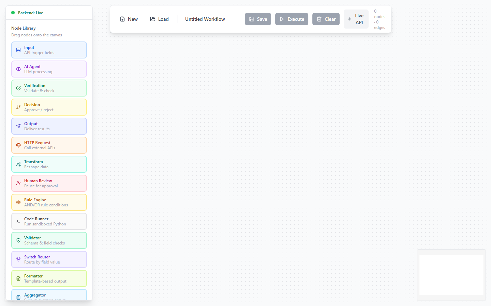
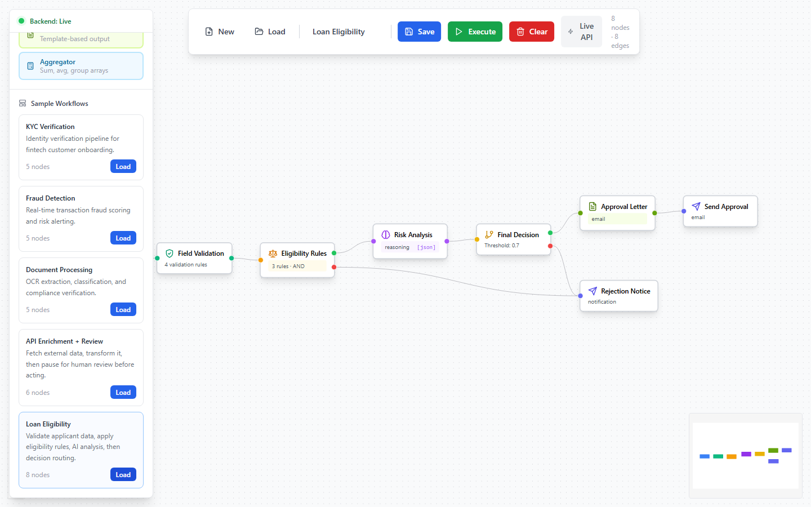
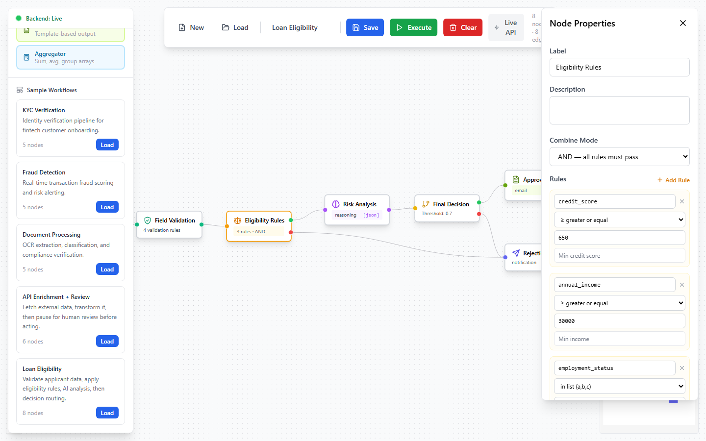
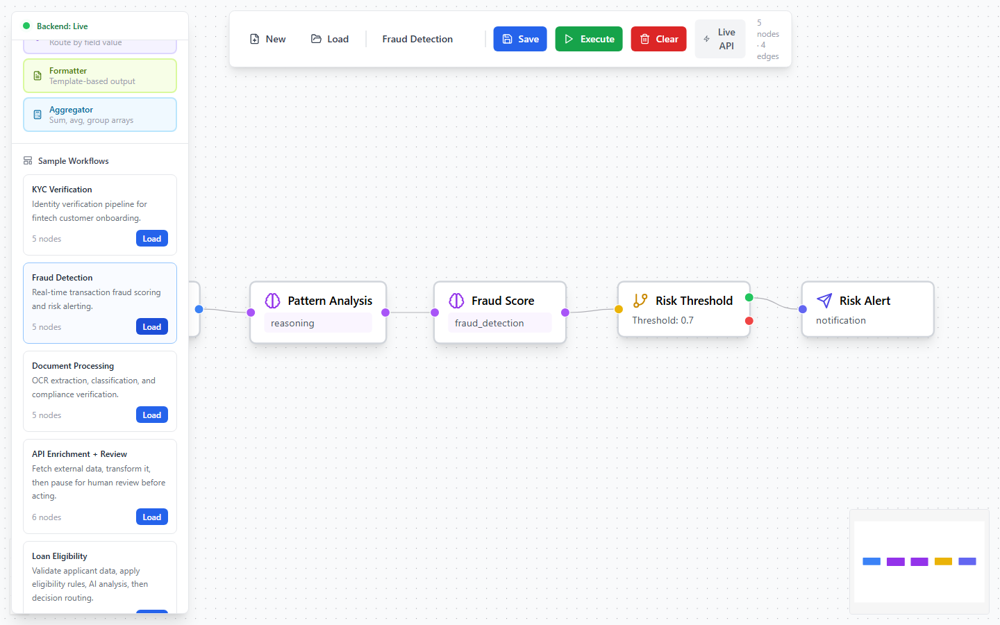
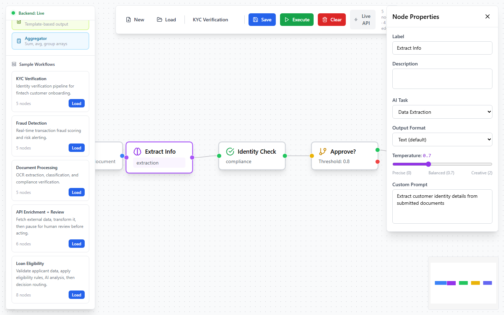
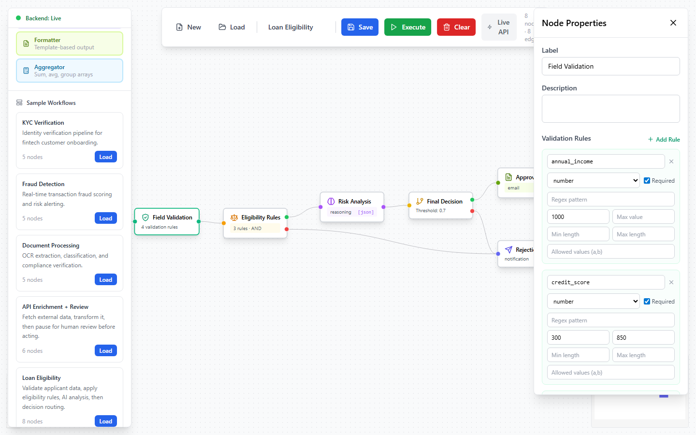
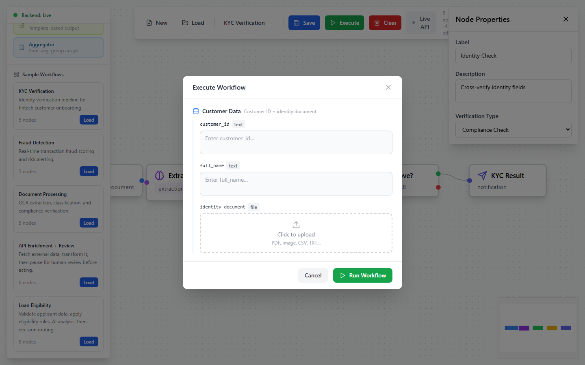

# FlowMind AI — Visual AI Workflow Builder

**Build, run, and automate AI-powered pipelines using a drag-and-drop canvas. No code required.**

FlowMind AI is an open-source platform for creating multi-step AI workflows visually. Connect nodes on a canvas, configure them through a properties panel, and execute the workflow via the built-in UI or a REST API trigger — all backed by Google Gemini, FastAPI, and PostgreSQL.

---

## What It Does

You drag nodes onto a canvas, connect them with edges, and each connection tells the system how data flows. When you run a workflow:

1. Input data enters through an **Input node** (from the UI or a webhook)
2. It passes through any combination of AI nodes, rule engines, validators, HTTP calls, transformers, and more
3. Conditional routing nodes send data down different branches based on results
4. It exits through an **Output node** — as an API response, notification, database write, or webhook

Every step is logged with full model inputs/outputs so you can debug exactly what happened.

---

## Screenshots

**Node library and empty canvas**


**Loan Eligibility workflow** — Input → Validator → Rule Engine → AI Analysis → Decision → Formatter → Output, with conditional branching


**Rule Engine properties panel** — AND/OR conditions with 18 operators, no LLM


**Fraud Detection workflow** — dual AI nodes feeding a Decision node with approve/reject routing


**AI Agent properties panel** — task type, output format, temperature slider, custom prompt


**Validator node properties** — field-level schema rules with type, required, min/max, enum


**Execute modal** — input fields collected per-node before running, with file upload support


---

## Key Features

- **14 built-in node types** covering AI, HTTP, rules, code, validation, routing, formatting, and aggregation
- **Visual canvas** — drag, drop, connect, and configure entirely in the browser (React Flow)
- **Routing-aware execution engine** — conditional branches only fire when active; a Decision node's "rejected" branch never runs if the result is "approved"
- **Live API trigger** — every saved workflow gets a `/trigger` endpoint callable from any system
- **Full execution trace** — every node's prompt, model output, and result is logged and displayed
- **AI output formats** — text, JSON, CSV, HTML, Markdown, table, bullet list, or a custom JSON schema you define
- **Sandboxed Python execution** — run arbitrary Python snippets with an allowlisted stdlib and configurable timeout
- **Human-in-the-loop** — pause a workflow mid-execution for manual review before continuing
- **Docker Compose** — the entire stack starts with one command

---

## Node Types

| Node | Color | Purpose |
|---|---|---|
| Input | Blue | API trigger — defines the fields the workflow accepts |
| AI Agent | Purple | LLM call (Gemini) with task type, temperature, output format |
| Verification | Green | AI-powered consistency, compliance, or PII checks |
| Decision | Yellow | AI-powered approve/reject with confidence threshold |
| Output | Indigo | Deliver results (API, DB write, webhook, Slack, email) |
| HTTP Request | Orange | Call any external API with auth, headers, body templates |
| Transform | Teal | Rename/filter/reshape data without an LLM |
| Human Review | Rose | Pause execution for manual approval |
| Rule Engine | Amber | AND/OR business rules with 18 operators — no LLM |
| Code Runner | Zinc | Sandboxed Python with json, re, math, datetime |
| Validator | Emerald | Field-level schema validation — halts workflow on failure |
| Switch Router | Violet | Route to N branches by field value (supports OR via `|`) |
| Formatter | Lime | Template-based output rendering (text, HTML, Markdown, email) |
| Aggregator | Sky | sum, avg, count, group_by, join, unique over arrays |

---

## Tech Stack

| Layer | Technology |
|---|---|
| Frontend | React 18, TypeScript, React Flow, Zustand, Tailwind CSS, Vite |
| Backend | FastAPI, Python 3.11, SQLAlchemy 2, Pydantic v2, asyncio |
| AI | LangChain + Google Gemini (`gemini-1.5-flash` default) |
| Database | PostgreSQL 15 |
| Cache/Queue | Redis 7 |
| HTTP client | httpx (async) |
| Containers | Docker + Docker Compose |

---

## Quick Start

### Prerequisites

- Docker and Docker Compose installed
- A [Google AI Studio](https://aistudio.google.com/) API key (free tier works)

### 1. Clone

```bash
git clone https://github.com/your-org/flowmind-ai.git
cd flowmind-ai
```

### 2. Configure environment

```bash
cp backend/.env.example backend/.env
```

Open `backend/.env` and set your Gemini API key:

```env
GEMINI_API_KEY="your-key-here"
GEMINI_MODEL="gemini-1.5-flash"
```

### 3. Start the backend stack

```bash
docker compose up --build
```

This starts PostgreSQL on `5432`, Redis on `6379`, and the FastAPI backend on `http://localhost:8000`.

### 4. Start the frontend

```bash
cd frontend
npm install
npm run dev
```

Open `http://localhost:5173`.

### 5. Build your first workflow

1. Drag an **Input** node onto the canvas
2. Drag an **AI Agent** node and connect them
3. Drag an **Output** node and connect it
4. Click **Save**, then **Execute**

---

## Running Without Docker

### Backend

```bash
cd backend
python -m venv venv
source venv/bin/activate        # Windows: venv\Scripts\activate
pip install -r requirements.txt
cp .env.example .env            # fill in your values
uvicorn app.main:app --reload --port 8000
```

You need a running PostgreSQL instance. Point `DATABASE_URL` in `.env` at it.

### Frontend

```bash
cd frontend
npm install
npm run dev
```

---

## Project Structure

```
flowmind-ai/
├── backend/
│   ├── app/
│   │   ├── api/workflows.py          # REST endpoints (CRUD + execute + trigger)
│   │   ├── core/
│   │   │   ├── config.py             # Settings loaded from .env
│   │   │   └── database.py           # SQLAlchemy engine + session factory
│   │   ├── models/workflow.py        # ORM models (Workflow, WorkflowExecution)
│   │   ├── schemas/workflow.py       # Pydantic v2 request/response schemas
│   │   ├── services/
│   │   │   └── workflow_executor.py  # All node logic + routing engine
│   │   └── main.py                   # FastAPI app, CORS, router setup
│   ├── Dockerfile
│   ├── requirements.txt
│   └── .env.example
├── frontend/
│   └── src/
│       ├── components/
│       │   ├── CustomNodes.tsx        # 14 visual node components (memo'd)
│       │   ├── NodePalette.tsx        # Left sidebar — draggable node library
│       │   ├── NodePropertiesPanel.tsx # Right sidebar — node config form
│       │   ├── WorkflowCanvas.tsx     # React Flow canvas wrapper
│       │   ├── ExecutionModal.tsx     # Run dialog + step trace viewer
│       │   ├── LoadWorkflowModal.tsx  # Load/delete saved workflows
│       │   ├── LiveApiPanel.tsx       # Shows /trigger URL and curl example
│       │   └── Toolbar.tsx            # Save / Load / Execute / API buttons
│       ├── data/sampleWorkflows.ts    # 5 pre-built example workflows
│       ├── services/api.ts            # Axios client for backend calls
│       ├── store/workflowStore.ts     # Zustand global state
│       └── types/workflow.ts          # TypeScript interfaces
├── docker-compose.yml
└── docs/
    ├── architecture.md
    ├── nodes.md
    ├── use-cases.md
    ├── execution-engine.md
    └── api-reference.md
```

---

## API Quick Reference

Every saved workflow gets two endpoints:

```
POST /api/v1/workflows/{id}/execute    # Run from the UI
POST /api/v1/workflows/{id}/trigger    # Run from any external system
```

**Trigger example:**

```bash
curl -X POST http://localhost:8000/api/v1/workflows/{workflow_id}/trigger \
  -H "Content-Type: application/json" \
  -d '{"customer_id": "cust_123", "amount": 4999.00}'
```

**Response:**

```json
{
  "workflow_id": "...",
  "execution_id": "...",
  "status": "completed",
  "output": { "decision": "approved", "confidence": 0.91 }
}
```

Full API docs: [docs/api-reference.md](docs/api-reference.md)

---

## Docs

| Document | What it covers |
|---|---|
| [Architecture](docs/architecture.md) | System design, data flow, component map, database schema |
| [Node Reference](docs/nodes.md) | Every node type — config fields, input/output schema, examples |
| [Use Cases](docs/use-cases.md) | KYC, fraud, loan eligibility, document processing, data pipelines |
| [Execution Engine](docs/execution-engine.md) | How conditional routing works internally |
| [API Reference](docs/api-reference.md) | All REST endpoints with request/response bodies |

---

## Sample Workflows

Five workflows are included and loadable from the Node Palette sidebar:

| Name | Nodes used |
|---|---|
| **KYC Verification** | Input → AI Extraction → Verification → Decision → Output |
| **Fraud Detection** | Input → AI Pattern Analysis → AI Fraud Score → Decision → Output |
| **Document Processing** | Input → AI OCR → AI Classification → Verification → Output |
| **API Enrichment + Review** | Input → HTTP → Transform → AI → Human Review → Output |
| **Loan Eligibility** | Input → Validator → Rule Engine → AI → Decision → Formatter → Output |

---

## Changing the AI Model

Edit `backend/.env`:

```env
GEMINI_MODEL="gemini-1.5-flash"    # faster, cheaper (default)
GEMINI_MODEL="gemini-1.5-pro"      # more capable, slower
```

Then: `docker compose restart backend`. No code changes needed.

---

## Contributing

Contributions are welcome. The codebase is intentionally kept straightforward.

**Adding a new node type** requires touching 6 files:
1. `workflow_executor.py` — add `execute_<name>_node()` and register in `_execute_node()`
2. `CustomNodes.tsx` — add the visual component
3. `WorkflowCanvas.tsx` — register in `nodeTypes` and minimap colors
4. `workflowStore.ts` — add default data and label in `addNode()` / `getNodeLabel()`
5. `NodePropertiesPanel.tsx` — add the config form section
6. `types/workflow.ts` — add the type string to the `NodeType` union

Please read [docs/architecture.md](docs/architecture.md) before making structural changes.

Bug reports: open an issue and paste the execution trace JSON from the step that failed.

---

## License

MIT — see `LICENSE`.

---

## Origin

FlowMind AI was conceived and originally designed by **[Soham Vyas](https://github.com/sohamvyas73)**. The core idea — making AI pipeline automation as simple as connecting blocks on a canvas, without writing orchestration code — came from his work on AI-driven product workflows and the gap he saw between powerful LLM capabilities and the tooling available to non-ML engineers.

---

## Acknowledgements

- [React Flow](https://reactflow.dev/) — the canvas engine
- [LangChain](https://langchain.com/) — LLM abstraction layer
- [Google Gemini](https://ai.google.dev/) — the default AI model
- [FastAPI](https://fastapi.tiangolo.com/) — backend framework
